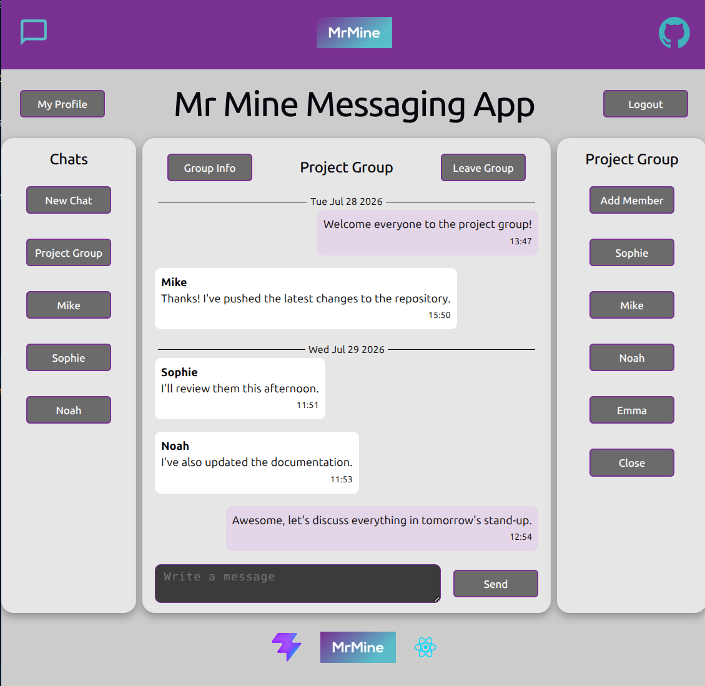

# Messaging App - Frontend Repo (Backend is Separate)

A frontend repo for a Messaging App - similar to WhatsApp, by Michael Mine.

Live Link on Netlify: https://mrmine-messaging-app.netlify.app/



This is one of the final projects from The Odin Project - a free, open-source curriculum teaching full-stack web development.

Built from scratch with Vite using React and Javascript with 141 tests using Vitest and React Testing Library. Hosted on Netlify.

Connects to a separate backend API repo using Node, Express, PostgreSQL and Prisma ORM. Hosted on Railway.

API repo here: https://github.com/Michael-Mine/odin-messaging-app-api

Note: As backend is REST API, it cannot handle real time updates. Page reloads (top left icon) are needed to check for new messages.

## Features

- Create chats and send messages to another user.
- Create group chats for multiple users with ability to leave.
- Updatable profiles for users to view.
- Authorisation using Json Web Tokens (JWTs).
- Validations on backend.

## Tech Stack

| Layer    | Technologies                                |
| -------- | ------------------------------------------- |
| Frontend | React, JavaScript, Vite, Native CSS modules |
| Backend  | Node, Express, JavaScript                   |
| Database | PostgreSQL, Prisma ORM                      |
| Testing  | Vitest, React Testing Library, Jest         |

## System Architecture

The application is split into a 2 repos for clear separation of concerns.

- **Server**: A RESTful API focused on controller functions and middleware validation.
- **Client**: Component-based SPA.

## Database Schema

```prisma
model User {
  id            Int       @id @default(autoincrement())
  username      String    @unique
  password      String
  name          String
  bio           String?
  createdAt     DateTime  @default(now())
  updatedAt     DateTime  @default(now())
  deletedAt     DateTime?
  messages      Message[]
  chats         Chat[]
}

model Message {
  id          Int     @id @default(autoincrement())
  cuid        String  @default(cuid(2))
  sender      User    @relation(fields: [senderId], references: [id])
  senderId    Int
  chat        Chat    @relation(fields: [chatId], references: [id])
  chatId      Int
  content     String?
  createdAt   DateTime  @default(now())
  deletedAt   DateTime?
}

model Chat {
  id            Int       @id @default(autoincrement())
  cuid          String    @default(cuid(2))
  subject       String?
  messages      Message[]
  users         User[]
  createdAt     DateTime  @default(now())
  deletedAt     DateTime?
  lastMessageAt DateTime?
}
```

## API Endpoints

| Method | Endpoint    | Description              | Auth |
| ------ | ----------- | ------------------------ | ---- |
| POST   | /sign-up    | Create a new account     | No   |
| POST   | /login      | Authenticate a user      | No   |
| POST   | /user-chats | Get all chats for a user | Yes  |
| POST   | /chat       | Create a new chat        | Yes  |
| PUT    | /chat       | Add a user to chat       | Yes  |
| DELETE | /chat       | Remove a user from chat  | Yes  |
| POST   | /message    | Send a message           | Yes  |
| POST   | /profile    | Get a user's profile     | Yes  |
| PUT    | /profile    | Update a user's profile  | Yes  |

Note: POST used instead of GET due to JWTs needed in request body for authentication.

## Local Development

### Setup

**1. Clone & Install:**

```bash
git clone https://github.com/Michael-Mine/odin-messaging-app-fe.git

npm install
```

**2. Environment Setup:**

Create a `.env` in root with `VITE_API_URL="http://localhost:3000/"`

**3. Run Development Server:**

```bash
npm run dev
```

**4. Run Tests:**

```bash
npm run test
```

## Deployment on Netlify

1. Link GitHub repo

2. Check default Build command is as:

```bash
npm run dev
```

3. Check default Publish directory is as `dist`

4. Add an environment variable key: `VITE_API_URL` with value as the public hosted URL for the API repo.
